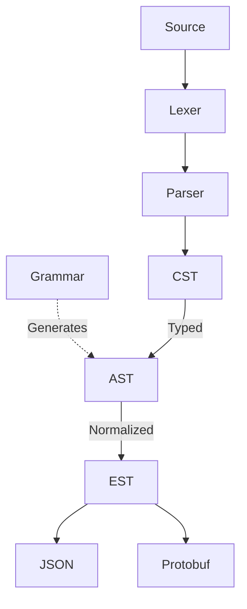

# Architecture

This document describes the high-level architecture of `duramen`.

Terminology:
- CST: Concrete Syntax Tree (lossless representation)
- AST: Abstract Syntax Tree (typed representation for tooling)
- EST: External Syntax Tree (normalized representation for serialization)

## Lexer

Our lexer is hand-written, zero-copy, operating on byte offsets rather than copied strings.

## Grammar

Our grammars are defined using [`ungrammar`](https://github.com/rust-analyzer/ungrammar). This allows us to generate our AST via an [`xtask`](https://github.com/matklad/cargo-xtask) workflow.

They are based on the upstream Cedar grammars:
- [Policy](https://docs.cedarpolicy.com/policies/syntax-grammar.html)
- [Schema](https://docs.cedarpolicy.com/schema/human-readable-schema-grammar.html)

## CST

Our parser produces a lossless CST using [`syntree`](https://github.com/udoprog/syntree).

We follow a [recursive descent](https://matklad.github.io/2023/05/21/resilient-ll-parsing-tutorial.html) design, with a [Pratt parser](https://matklad.github.io/2020/04/13/simple-but-powerful-pratt-parsing.html) for expressions.

### Safety

To ensure the parser cannot loop infinitely, we use [advance assertions](https://matklad.github.io/2025/12/28/parsing-advances.html) to verify that each loop iteration consumes at least one token.

In the future, we may also add a fuel system and/or nesting depth limits.

### Diagnostics

We use recovery tokens to enable resilient parsing, continuing after errors to report multiple diagnostics.

Rich error messages are then rendered using [`annotate-snippets`](https://github.com/rust-lang/annotate-snippets-rs).

## AST

The AST consists of typed wrappers generated from our grammar definitions.

It provides a high-level API for tooling such as formatters, linters, and language servers.

## EST

The EST is our normalized representation for serialization.

It performs:
- Removal of trivial tokens (comments, whitespace, newlines)
- Operator normalization (e.g. replacing `>` with `!(<=)`)

Unlike upstream Cedar, all serialization formats share this common representation to ensure consistency.

### JSON

Our JSON layer is powered by either [`serde`](https://github.com/serde-rs/serde) or [`facet`](https://github.com/facet-rs/facet).

### Protobuf

Our Protobuf layer is powered by [`prost`](https://github.com/tokio-rs/prost).

Structs are generated from upstream `.proto` files via `xtask`, ensuring compatibility.

## Inspiration

The architecture of `duramen` is heavily inspired by [rust-analyzer](https://github.com/rust-lang/rust-analyzer) and the writings of [matklad](https://matklad.github.io).
