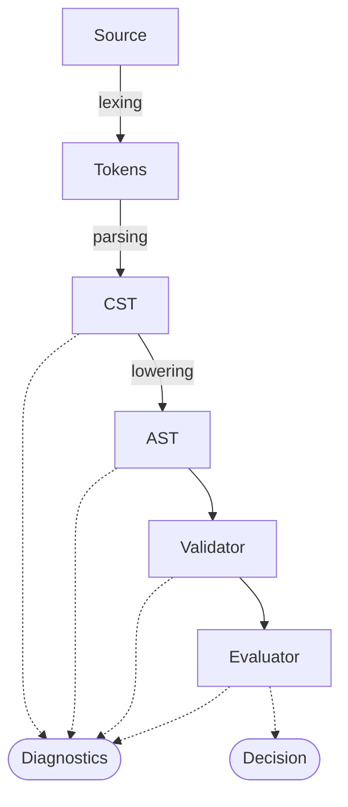

# `duramen`

A Cedar implementation.

> [!WARNING]
> Not ready for use.

## Architecture

## Disclaimer

Duramen is not an official Cedar project.

Cedar is a trademark of Amazon Web Services, and a member of the Cloud Native Computing Foundation.

## License

`duramen` is licensed under the terms of both the [MIT License](LICENSE-MIT) and the [Apache License (Version 2.0)](LICENSE-APACHE).
