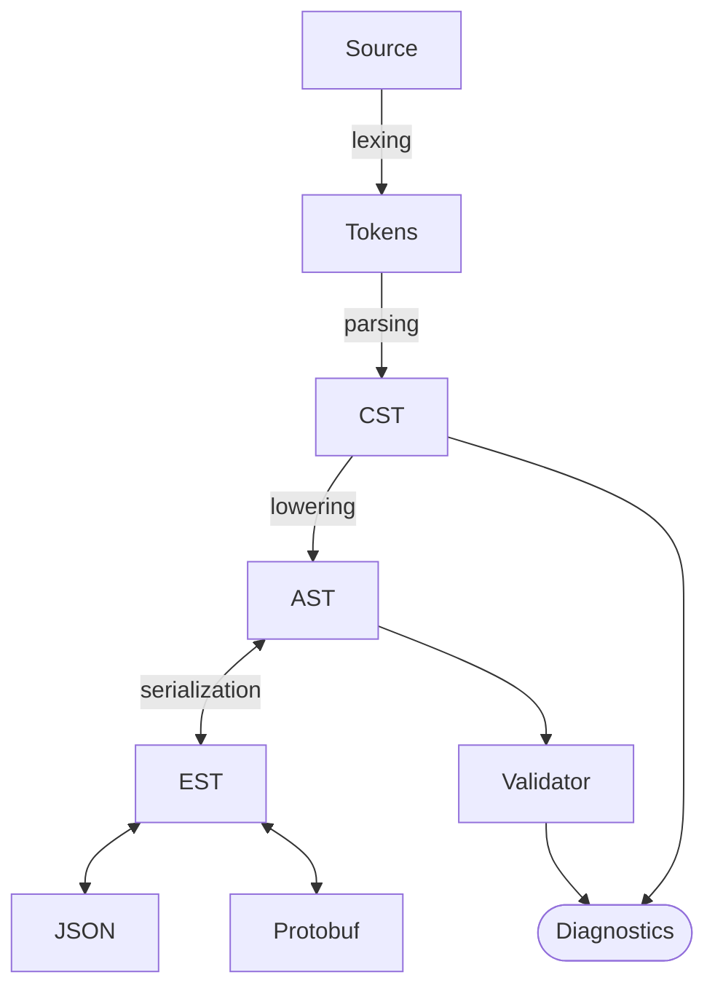

# `duramen`

A Cedar implementation.

> [!WARNING]
> Not ready for use.

## Architecture

```mermaid
flowchart TD
    Source -->|lexing| Tokens
    Tokens -->|parsing| CST
    CST -->|lowering| AST
    CST --> Diagnostics([Diagnostics])
    AST <-->|serialization| EST
    EST <--> JSON
    EST <--> Protobuf
    AST --> Validator
    Validator --> Diagnostics
```

## Disclaimer

Duramen is not an official Cedar project.

Cedar is a trademark of Amazon Web Services, and a member of the Cloud Native Computing Foundation.
